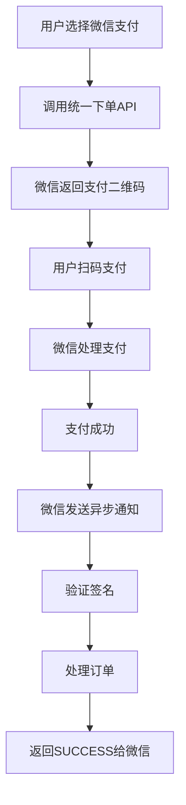

# 微信支付配置说明

## 1. 申请微信支付商户号

1. 访问 [微信支付商户平台](https://pay.weixin.qq.com/)
2. 完成企业认证和微信支付开通申请
3. 获取商户号(mch_id)和支付密钥

## 2. 获取必要的配置信息

### 应用ID (WECHAT_APP_ID)
- 在微信公众平台或开放平台获取
- 如果使用公众号支付，使用公众号的AppID
- 如果使用APP支付，使用移动应用的AppID

### 商户号 (WECHAT_MCH_ID)
- 在微信支付商户平台可以查看
- 格式：10位数字，如：1234567890

### API密钥 (WECHAT_API_KEY)
- 在微信支付商户平台设置
- 路径：账户中心 -> API安全 -> 设置API密钥
- 密钥长度为32位

### 商户证书 (可选，用于退款等高级功能)
- 在微信支付商户平台下载
- 包含：apiclient_cert.pem 和 apiclient_key.pem

## 3. 环境变量配置

在 `.env.local` 文件中添加以下配置：

```bash
# 微信支付配置
WECHAT_APP_ID=your_wechat_app_id
WECHAT_MCH_ID=your_mch_id
WECHAT_API_KEY=your_api_key

# 应用基础URL
NEXT_PUBLIC_BASE_URL=https://yourdomain.com
```

## 4. 配置微信支付参数

### 支付授权目录设置
在微信支付商户平台设置支付授权目录：
1. 登录微信支付商户平台
2. 产品中心 -> 开发配置
3. 支付配置 -> 添加支付授权目录
4. 设置：`https://yourdomain.com/payment/`

### 异步通知URL设置
程序中已配置异步通知URL：`https://yourdomain.com/api/payment/wechat/notify`

## 5. 支付类型说明

### NATIVE支付（扫码支付）
- 适用于PC端网站
- 生成二维码，用户使用微信扫码支付
- 当前实现使用此方式

### JSAPI支付（公众号支付）
- 适用于微信内置浏览器
- 需要用户在微信环境下访问
- 需要获取用户openid

### H5支付（手机网站支付）
- 适用于手机浏览器
- 唤起微信支付页面
- 有一定的使用限制

## 6. 测试环境配置

### 沙箱环境
微信支付提供沙箱环境用于测试：
1. 在商户平台申请沙箱环境
2. 获取沙箱密钥和参数
3. 使用沙箱API地址进行测试

### 测试工具
- 微信开发者工具
- 微信支付接口调试工具
- Postman等API测试工具

## 7. 安全注意事项

1. **API密钥安全**：API密钥绝对不能泄露，建议定期更换
2. **签名验证**：所有回调都必须验证微信签名
3. **金额验证**：回调时必须验证订单金额是否正确
4. **订单状态**：只处理 `return_code=SUCCESS` 且 `result_code=SUCCESS` 的订单
5. **幂等性**：同一订单的回调可能收到多次，需要保证处理的幂等性

## 8. 常见问题

### Q: 签名验证失败？
A: 检查以下几点：
- API密钥是否正确
- 参数编码是否为UTF-8
- 签名算法是否为MD5
- 参数排序是否正确

### Q: 回调地址无法访问？
A: 确保：
- 回调地址可以从外网访问
- 服务器防火墙已开放相应端口
- 使用HTTPS协议（生产环境必须）

### Q: 二维码无法生成？
A: 可能原因：
- 商户号或API密钥错误
- 订单金额格式不正确（必须为分）
- 支付授权目录配置错误

## 9. 生产环境部署

1. **域名备案**：确保域名已完成ICP备案
2. **HTTPS证书**：生产环境必须使用HTTPS
3. **商户认证**：完成微信支付商户认证
4. **测试验证**：进行小额真实支付测试
5. **监控告警**：设置支付监控和异常告警

## 10. 支付流程图



## 11. 相关文档

- [微信支付开发文档](https://pay.weixin.qq.com/wiki/doc/api/index.html)
- [NATIVE支付API](https://pay.weixin.qq.com/wiki/doc/api/native.php?chapter=9_1)
- [微信支付商户平台](https://pay.weixin.qq.com/)
- [微信开发者工具](https://developers.weixin.qq.com/miniprogram/dev/devtools/download.html)

## 12. SDK使用说明

项目使用 `tenpay` SDK进行微信支付集成：

```bash
npm install tenpay
```

主要特性：
- 支持所有微信支付方式
- 自动签名生成和验证
- TypeScript支持
- 完整的错误处理 